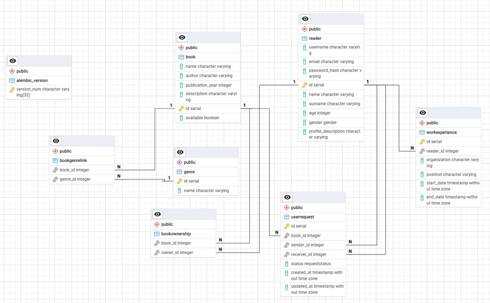

# Задание и модели

### Текст задания

Тема: **Разработка веб-приложения для буккросинга**


Задача - создать веб-приложение, которое позволит пользователям обмениваться книгами между собой. Это приложение должно облегчать процесс обмена книгами, позволяя пользователям находить книги, которые им интересны, и находить новых пользователей для обмена книгами. Функционал веб-приложения должен включать следующее:

1. **Создание профилей:** Возможность пользователям создавать профили, указывать информацию о себе, своих навыках, опыте работы и предпочтениях по проектам.

2. **Добавление книг в библиотеку:** Пользователи могут добавлять книги, которыми они готовы поделиться, в свою виртуальную библиотеку на платформе.

3. **Поиск и запросы на обмен:** Функционал поиска книг в библиотеке других пользователей. Возможность отправлять запросы на обмен книгами другим пользователям.

4. **Управление запросами и обменами:** Возможность просмотра и управления запросами на обмен. Возможность подтверждения или отклонения запросов на обмен.

### Модели и база данных

Были созданы следующие модели:

* Модель читателя, которая содержит базовую информацию о нем. В ее основе лежит модель пользователя, которая хранит в себе данные для авторизации (почта, юзернейм и захешированный пароль);
* Модель книги с информацией о ней (автор, год издания, описание);
* Модель жанра, которая хранит в себе его название;
* Модель опыта работы, которая хранит подробную информацию о всех местах работы читателя;
* Модель заявки на обмен книги. Она хранит в себе информацию об отправителе и получателе запроса, а также ее статус и время создания/обновления;
* Две дополнительные модели связывают книгу и читателя, книгу и жанр.



### Базовые модели

Включают в себя модели юзера с функциями хеширования и верификации пароля, базовые модели книги и рабочего опыта, а также две Enum-модели: гендер и статус запроса.

``` py title="base_models.py"
class User(SQLModel):
    username: str
    email: str
    password_hash: str

    def hash_password(self, password: str):
        self.password_hash = pwd_context.hash(password)

    def verify_password(self, password: str):
        return pwd_context.verify(password, self.password_hash)


class BookBase(SQLModel):
    name: str
    author: str
    publication_year: int
    description: Optional[str] = None


class Gender(str, Enum):
    male = "male"
    female = "female"
    other = "other"


class RequestStatus(str, Enum):
    pending = "pending"
    rejected = "rejected"
    approved = "approved"


class WorkExperienceBase(SQLModel):
    organization: str
    position: str
    start_date: datetime
    end_date: Optional[datetime] = None

```

### Остальные модели

Здесь обозначены все те модели, которые были упомянуты в самом начале + несколько моделей в конце для корректного отображения вложенных моделей.

``` py title="models.py"
class BookOwnership(SQLModel, table=True):
    book_id: Optional[int] = Field(
        default=None, foreign_key="book.id", primary_key=True
    )
    owner_id: Optional[int] = Field(
        default=None, foreign_key="reader.id", primary_key=True
    )
    book: Optional["Book"] = Relationship(back_populates="ownerships")
    owner: Optional["Reader"] = Relationship(back_populates="ownerships")

    class Config:
        orm_mode = True


class BookGenreLink(SQLModel, table=True):
    book_id: Optional[int] = Field(
        default=None, foreign_key="book.id", primary_key=True
    )
    genre_id: Optional[int] = Field(
        default=None, foreign_key="genre.id", primary_key=True
    )
    book: Optional["Book"] = Relationship(back_populates="genre_links")
    genre: Optional["Genre"] = Relationship(back_populates="book_links")

    class Config:
        from_attributes = True


class Genre(SQLModel, table=True):
    id: Optional[int] = Field(default=None, primary_key=True)
    name: str
    books: List["Book"] = Relationship(
        back_populates="genres", link_model=BookGenreLink
    )
    book_links: List["BookGenreLink"] = Relationship(back_populates="genre")

    class Config:
        from_attributes = True


class Book(BookBase, table=True):
    id: Optional[int] = Field(default=None, primary_key=True)
    available: bool = Field(default=True)
    readers: List["Reader"] = Relationship(
        back_populates="books", link_model=BookOwnership
    )
    ownerships: List[BookOwnership] = Relationship(back_populates="book")
    genres: List[Genre] = Relationship(back_populates="books", link_model=BookGenreLink)
    genre_links: List[BookGenreLink] = Relationship(back_populates="book")

    class Config:
        orm_mode = True


class WorkExperience(WorkExperienceBase, table=True):
    id: Optional[int] = Field(default=None, primary_key=True)
    reader_id: int = Field(foreign_key="reader.id")
    reader: Optional["Reader"] = Relationship(back_populates="work_experience")

    class Config:
        orm_mode = True


class Reader(User, table=True):
    id: Optional[int] = Field(default=None, primary_key=True)
    name: str
    surname: str
    age: int
    gender: Gender
    profile_description: Optional[str] = None
    work_experience: List[WorkExperience] = Relationship(back_populates="reader")
    books: List[Book] = Relationship(back_populates="readers", link_model=BookOwnership)
    ownerships: List[BookOwnership] = Relationship(back_populates="owner")

    class Config:
        orm_mode = True


class UserRequest(SQLModel, table=True):
    id: Optional[int] = Field(default=None, primary_key=True)
    book_id: int = Field(foreign_key="book.id")
    sender_id: int = Field(foreign_key="reader.id")
    receiver_id: int = Field(foreign_key="reader.id")
    status: RequestStatus = Field(default=RequestStatus.pending)
    created_at: datetime = Field(default_factory=datetime.utcnow)
    updated_at: datetime = Field(default_factory=datetime.utcnow)

    def approve(self):
        self.status = RequestStatus.approved
        self.updated_at = datetime.utcnow()

    def reject(self):
        self.status = RequestStatus.rejected
        self.updated_at = datetime.utcnow()

    class Config:
        orm_mode = True


class ReaderResponse(SQLModel):
    id: int
    username: str
    email: str
    name: str
    surname: str
    age: int
    gender: Gender
    profile_description: Optional[str] = None
    books: List[BookBase] = []
    work_experience: List[WorkExperienceBase] = []

    class Config:
        orm_mode = True


class BookOwnershipResponse(SQLModel):
    book: Book
    owner: ReaderResponse

    class Config:
        orm_mode = True


class BookResponse(SQLModel):
    id: int
    name: str
    author: str
    publication_year: int
    description: Optional[str] = None
    available: bool
    genres: List[Genre] = []

    class Config:
        orm_mode = True

```

