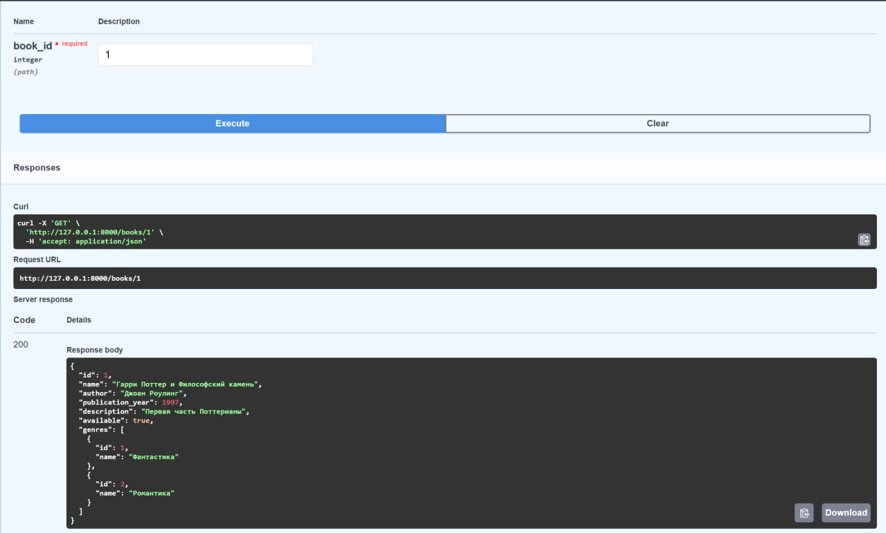

# Работа с книгами

Для книг были созданы следующие эндпоинты:

* `/new_book` - POST-запрос на создание книги
* `/books` - GET-запрос на получение информации о всех книгах с вложенными моделями жанра
* `/books/{book_id}` - GET-запрос на получение информации о книге с вложенными моделями жанра
* `/change_book/{book_id}` - PUT-запрос на изменение информации о книге 
* `/delete_book/{book_id}` - DELETE-запрос на удаление книги

Для жанра были созданы следующие эндпоинты:

* `/new_genre` - POST-запрос на создание жанра
* `/genres` - GET-запрос на получение информации о всех жанрах
* `/genres_book/{genre_id}` - GET-запрос на получение информации о конкретном жанре
* `/book_genre_link` - POST-запрос на связывание книги и жанра
* `/book_genre_link/delete/{genre_id}/{book_id}` - DELETE-запрос на удаление книги и жанра

Функционал владения книгой, а также реализация обмена:

* `/new_ownership` - POST-запрос на создание владение читателем книги
* `/ownerships` - GET-запрос на получение информации о всех владениях книгами
* `/ownership/delete/{book_id}/{owner_id}` DELETE-запрос на удаление связи читателя и книги
* `/new_request` - POST-запрос на обмен книгой с другим пользователем
* `/requests` - GET-запрос на получение информации о всех запросах 
* `/requests/{request_id}/approve` - POST-запрос на одобрение сделки
* `/requests/{request_id}/reject` - POST-запрос на отказ сделки

### Примеры некоторых запросов

Вывод конкретной книги с вложенными жанрами:

Создание нового жанра:

Неудачная попытка направить запрос на обмен. Пользователь должен быть авторизирован в системе, а также направлять запрос другому пользователю, у которого есть желаемая книга. В процессе обмена книги другой пользователь не имеет возможности направить запрос на нее:

Отказ на обмен. Книга остается у получателя запроса на обмен:
