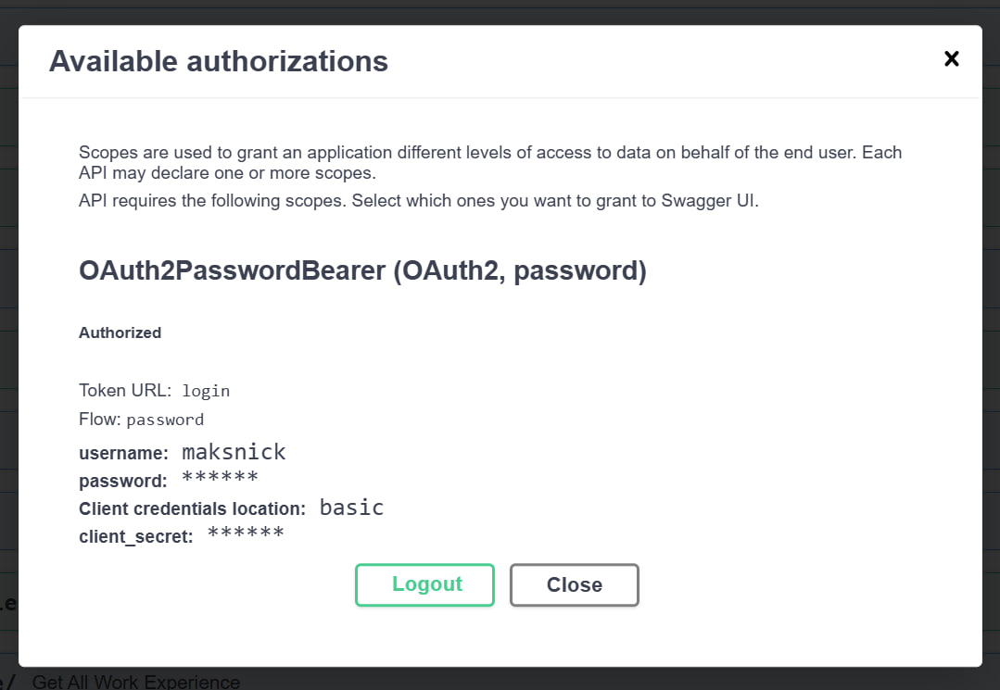
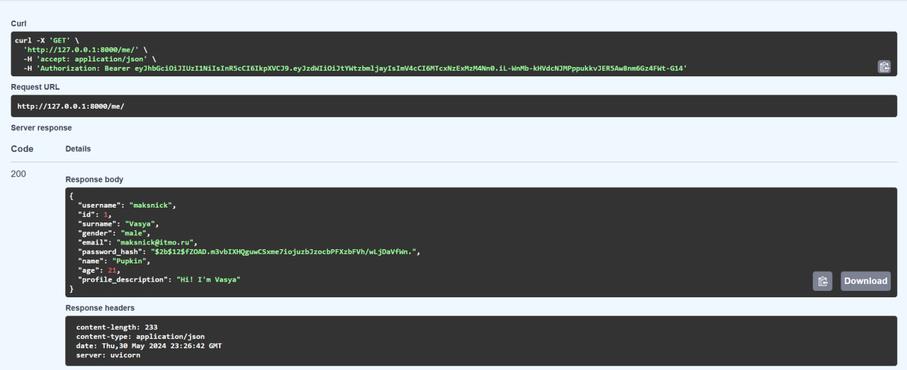
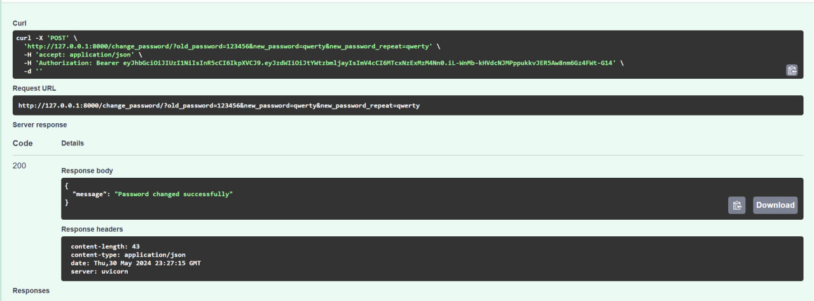
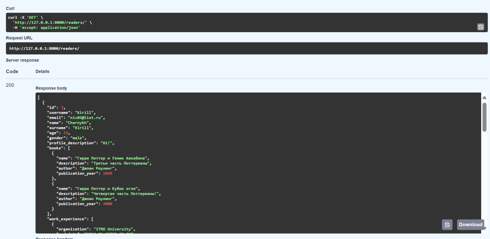

# Аутентификация

### Дополнительные функции

Для работы регистрации и входа пользователя для начала были написаны функции и переменные для создания токена, а также получения информации о текущем пользователе в системе. Функции хеширования пароля и его проверки сразу были добавлены в базовую модель пользователя.

``` py title="auth.py"
ACCESS_TOKEN_EXPIRE_MINUTES = 30
SECRET_KEY = "SahloFolina"
ALGORITHM = "HS256"

oauth2_scheme = OAuth2PasswordBearer(tokenUrl="login")


def create_access_token(data: dict, expires_delta: Optional[timedelta] = None):
    to_encode = data.copy()
    if expires_delta:
        expire = datetime.utcnow() + expires_delta
    else:
        expire = datetime.utcnow() + timedelta(minutes=15)
    to_encode.update({"exp": expire})
    encoded_jwt = jwt.encode(to_encode, SECRET_KEY, algorithm=ALGORITHM)
    return encoded_jwt


def get_current_user(
    token: str = Depends(oauth2_scheme), session: Session = Depends(get_session)
):
    credentials_exception = HTTPException(
        status_code=status.HTTP_401_UNAUTHORIZED,
        detail="Could not validate credentials",
        headers={"WWW-Authenticate": "Bearer"},
    )
    try:
        payload = jwt.decode(token, SECRET_KEY, algorithms=[ALGORITHM])
        username: str = payload.get("sub")
        if username is None:
            raise credentials_exception
    except JWTError:
        raise credentials_exception
    user = (
        session.query(models.Reader).filter(models.Reader.username == username).first()
    )
    if user is None:
        raise credentials_exception
    return user
```

### Эндпоинты

Для корректной работы аутентификации были созданы следующие эндпоинты:

* `/registration` - POST-запрос на регистрацию
* `/login` - POST-запрос на авторизацию 
* `/me` - GET-запрос на вывод текущего пользователя
* `/change_password` - POST-запрос на смену пароля

А также эндпоинты для работы с пользователем-читателем:

* `/readers` - GET-запрос на вывод всех существующих пользователей-читателей
* `/readers/{reader_id}` - GET-запрос на вывод конкретного пользователя-читателя (в отличии от /me не выводит пароль)
* `/readers/{reader_id}/add_experience` - POST-запрос на добавление опыта работы
* `/readers/{reader_id}/experience` - GET-запрос на просмотр опыта работы пользователя

### Примеры запросов

Вход в систему:


Текущий пользователь:


Смена пароля:


Получение всех читателей:


