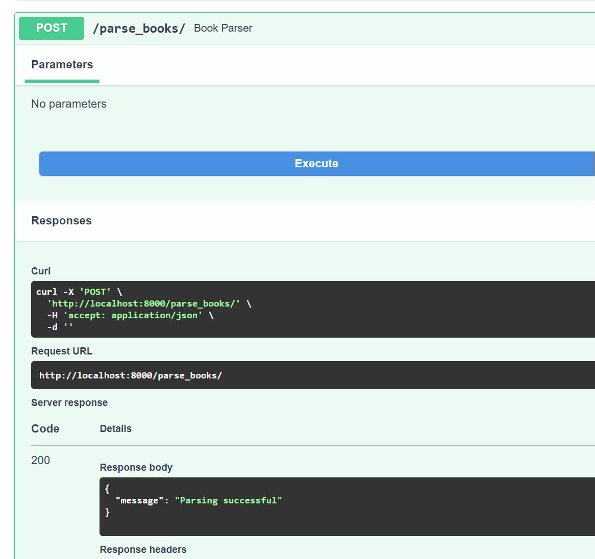

# Вызов парсера из FastAPI

### Задача

Добавить в FastAPI приложение эндпоинт, который будет принимать запросы с URL для парсинга от клиента, отправлять запрос парсеру (запущенному в отдельном контейнере) и возвращать ответ с результатом клиенту.

### Создание эндпоинта

В `app` был создан эндпоинт `parse_books`, который при запуске отправляет запрос на `http://web_parser:8002/parse_books` и тем самым запускает процесс сбора книг на стороне приложения-парсера.

