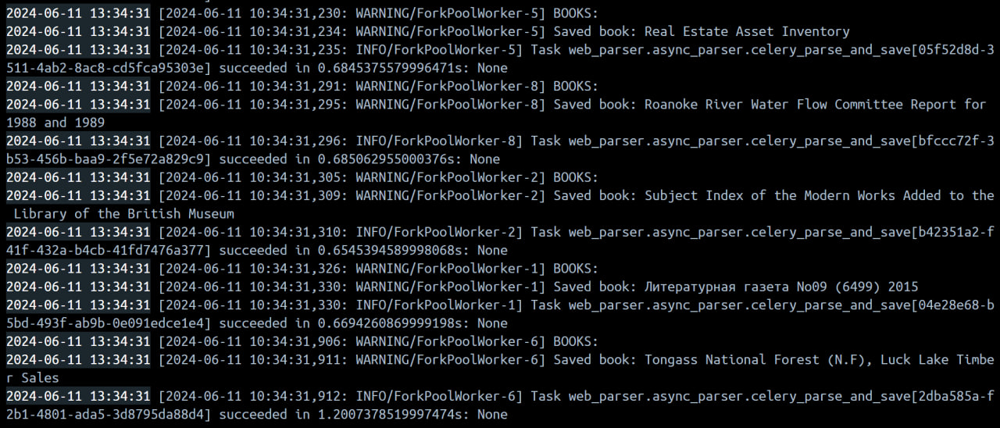

# Вызов парсера из FastAPI через очередь

### Задачи

1. Добавить зависимости для Celery и Redis в проект.
2. Создать файл конфигурации для Celery. Определть задачу для парсинга URL, которая будет выполняться в фоновом режиме.
3. Обновить Docker Compose файл.
4. Добавить в FastAPI приложение маршрут для асинхронного вызова парсера. 

### Настройка Celery

Для настройки Celery в приложении `web_parser` был создан новый файл для настройки зависимостей. В качестве брокера сообщений используется Redis. Дополнительно была настроена конфигурация приложения Celery для работы с json-данными.

``` py title="celery_parser.py"
from celery import Celery

celery_app = Celery(
    "tasks", broker="redis://redis:6379/0", backend="redis://redis:6379/0"
)

celery_app.conf.update(
    task_serializer="json",
    accept_content=["json"],
    result_serializer="json",
    timezone="UTC",
    enable_utc=True,
)

```

### Изменение docker-compose

Далее были внесены изменения в файл `docker-compose.yml`. Теперь будут упаковываться сервисы Celery и Redis, также добавлены зависимости между сервисами.

``` py title="docker-compose.yml"
version: '3.8'

services:
  db:
    image: postgres:16
    container_name: db
    environment:
      - POSTGRES_USER=postgres
      - POSTGRES_PASSWORD=M1m1m1m1
      - POSTGRES_DB=library
      - POSTGRES_HOST_AUTH_METHOD=trust
      - PGDATA=/var/lib/postgresql/data/pgdata
    ports:
      - "5434:5432"

  web:
    build:
      context: .
      dockerfile: /app/Dockerfile
    restart: always
    depends_on:
      - db
      - web_parser
      - redis
      - celery_worker
    environment:
      DB_ADMIN: postgresql://postgres:M1m1m1m1@db/library
    command: sh -c "sleep 10 && uvicorn app.main:app --host 0.0.0.0 --port 8000"
    ports:
      - "8000:8000"

  web_parser:
    build:
      context: .
      dockerfile: /web_parser/Dockerfile
    restart: always
    depends_on:
      - db
    environment:
      DB_ADMIN: postgresql://postgres:M1m1m1m1@db/library
    command: sh -c "sleep 10 && uvicorn web_parser.main:app --host 0.0.0.0 --port 8002"
    ports:
      - "8002:8002"

  redis:
    image: redis:latest
    container_name: redis
    ports:
      - "6379:6379"

  celery_worker:
    build:
      context: .
      dockerfile: /web_parser/Dockerfile
    command: celery -A web_parser.async_parser worker --loglevel=info
    depends_on:
      - redis
      - db
```

### Добавление новых эндпоинтов

В основное приложение и приложение-парсер были добавлены новые эндпоинты, чтобы можно было асинхронно собирать данные о книгах.

``` py title="web_parser/main.py"
@app.post("/celery_parse_books")
def parse_books(session: Session = Depends(get_session)):
    urls = fetch_random_book_ids(20)
    for url in urls:
        celery_parse_and_save.delay(url)
    return {"message": "Parsing started"}
```

``` py title="app/main.py"
@app.post("/celery_parse_books/")
def celery_book_parser(session: Session = Depends(get_session)):
    headers = {"accept": "application/json"}
    try:
        response = requests.post(
            "http://web_parser:8002/celery_parse_books",
            headers=headers,
        )
        response.raise_for_status()
        return {"message": "Parsing successful"}
    except:
        raise HTTPException(status_code=500, detail="Parsing unsuccessful")
```

Теперь можно запускать асинхронный парсинг книг через очередь.




